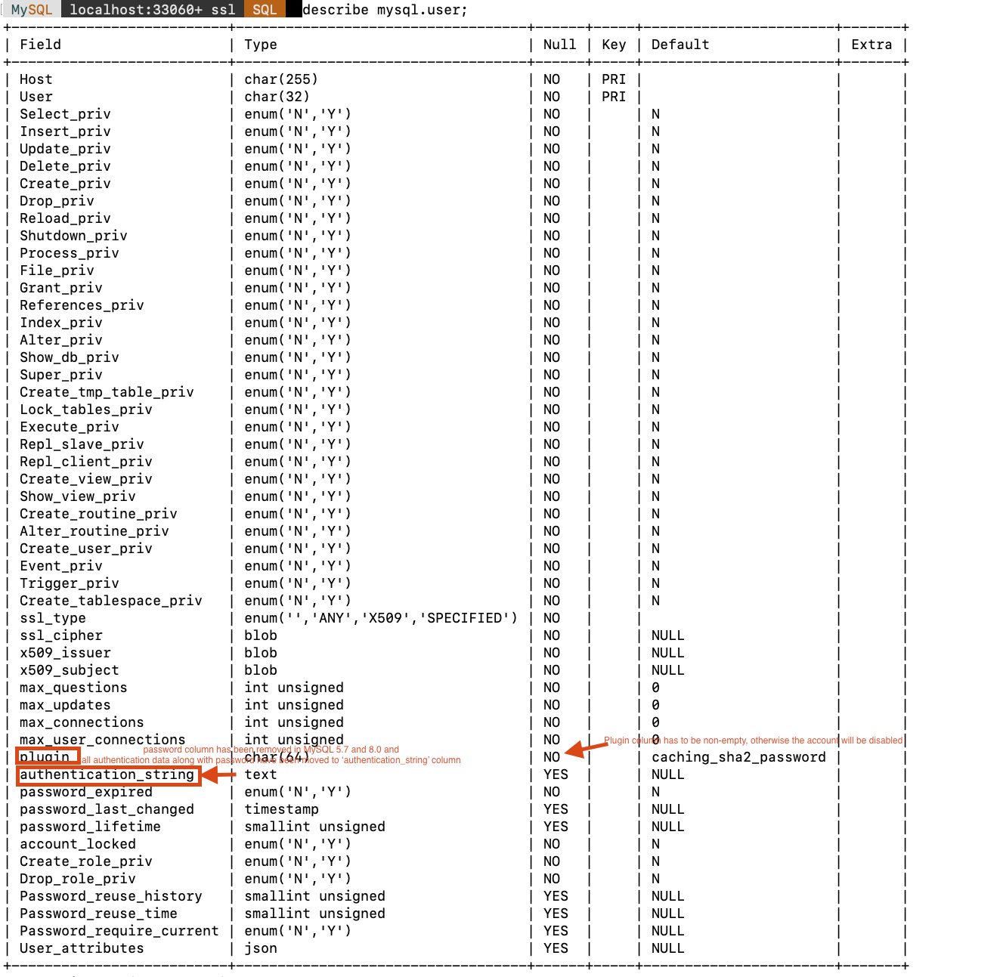

# Migrating MySQL 5.7 to MySQL 8 | Challenges
## CheckList
Ref: https://severalnines.com/database-blog/tips-for-upgrading-mysql-5-7-to-mysql-8

### Introduction:
- [x] For all of you who use MySQL 5.6, make sure you upgrade it to MySQL 5.7 first and then eventually to MySQL 8.0 
- [x] However, always note that migration is a one-way ticket. Once the upgrade is complte, there is no coming back. If you are plannign to migrate the MySQL 5.7 to MySQL 8.0, make sure to take a backup of your database directly before upgrade. 


### Priliminary Checklist 01: Sanity Check before upgrading
- [x] There must be no tables that use obsolete data types or function. 
  - [ ] In-place upgrade to MySQL 8.0 is not supported if tables contain old temporal columns in pre-5.6.4 format (TIME,DATETIME,TIMESTAMP columns without support for fractional seconds precision). If your tables still use the old temporal column format, upgrade using `REPAIR TABLE` before attmpting an in-place upgrade ti MySQL 8.0
- [ ] There must be no orphan .frm files
- [ ] Triggers must not have a missing or empty definer or an invalid creation context i.e.
  - [ ] character_set_client
  - [ ] collation_connection
  - [ ] Database collections 

**Simulation**
```bash
# Before you attempt anything, you should double-check that your existing MySQL 5.7 setup ticks all the boxes on the sanity checklist before upgrtading to MySQL 8.0
> mysqlcheck -u root -p --all-databases --check-upgrade
# If mysqlcheck reports any error, correct the issues;
---
classicmodels.customers                            Table is already up to date
classicmodels.employees                            Table is already up to date
classicmodels.offices                              Table is already up to date
classicmodels.orderdetails                         Table is already up to date
classicmodels.orders                               Table is already up to date
classicmodels.payments                             Table is already up to date
classicmodels.productlines                         Table is already up to date
classicmodels.products                             Table is already up to date
demo.t1                                            Table is already up to date
demo.t2                                            Table is already up to date
demo.t3                                            Table is already up to date
mysql.columns_priv                                 Table is already up to date
mysql.component                                    Table is already up to date
mysql.db                                           Table is already up to date
mysql.default_roles                                Table is already up to date
mysql.engine_cost                                  Table is already up to date
mysql.func                                         Table is already up to date
mysql.general_log                                  Table is already up to date
mysql.global_grants                                Table is already up to date
mysql.gtid_executed                                Table is already up to date
mysql.help_category                                Table is already up to date
mysql.help_keyword                                 Table is already up to date
mysql.help_relation                                Table is already up to date
mysql.help_topic                                   Table is already up to date
mysql.innodb_index_stats                           Table is already up to date
mysql.innodb_table_stats                           Table is already up to date
mysql.password_history                             Table is already up to date
mysql.plugin                                       Table is already up to date
mysql.procs_priv                                   Table is already up to date
mysql.proxies_priv                                 Table is already up to date
mysql.replication_asynchronous_connection_failover Table is already up to date
mysql.replication_asynchronous_connection_failover_managed Table is already up to date
mysql.replication_group_configuration_version      Table is already up to date
mysql.replication_group_member_actions             Table is already up to date
mysql.role_edges                                   Table is already up to date
mysql.server_cost                                  Table is already up to date
mysql.servers                                      Table is already up to date
mysql.slave_master_info                            Table is already up to date
mysql.slave_relay_log_info                         Table is already up to date
mysql.slave_worker_info                            Table is already up to date
mysql.slow_log                                     Table is already up to date
mysql.tables_priv                                  Table is already up to date
mysql.time_zone                                    Table is already up to date
mysql.time_zone_leap_second                        Table is already up to date
mysql.time_zone_name                               Table is already up to date
mysql.time_zone_transition                         Table is already up to date
mysql.time_zone_transition_type                    Table is already up to date
mysql.user                                         Table is already up to date
sys.sys_config                                     Table is already up to date
---

# Check if the following triggers or invalid context exists
- [x] character_set_client
- [x] collation_connection
- [x] Database collections 

> mysqlsh root@localhost --sql
sql> use infomation_schema;
   > SHOW TRIGGERS\G 
```

### Priliminary Checklist 02: Is any of your tables having non-native storage engines?
- [x] There must be no partition tables that use a storage engine that does not have native partitioning support.
- [ ] If you have any storage engine other than native partitioned support,, how to alter those to native storage engine.
- [ ] What if you have a storage engine having `MyISAM` tables and you need to convert those to `InnoDB`

**Simulation**
```bash
# Lets find out whether exisiting database having any storage enginer other than the native partition support
> mysqlsh root@localhost --sql
sql> SELECT TABLE_SCHEMA, TABLE_NAME
FROM INFORMATION_SCHEMA.TABLES
WHERE ENGINE NOT IN ('innodb', 'ndbcluster')
AND CREATE_OPTIONS LIKE '%partitioned%';

# Say, you have a storage engine other than native support and you want to alter theat to INNODB
> alter table table_name ENGINE = INNODB;
```

### Priliminary Checklist 06: changes in views
- [x] Information schema changes: Some of the views which were stored in the information_schema are not supported in MySQL 5.7
  - [ ] global_status
  - [ ] session_status
  - [ ] global_variables
  - [ ] session_variables
- [x] view `global_variables` is not avaibale in information_schema rather switched to performance_schema database in MySQL 5.7 and MySQL 8
- [ ] **Impact:** This issue can hit monitoring and trending system which may use those queries to collect MySQL metrics.

**Simulation:**
```bash
# Simulation-01
# information_schema.global_variables view is not available in MySQL 5.7 and not even in MySQL 8.0, you will find it under performance_schema table
mysqlsh root@localhost --sql
sql> select * from information_schema.global_variables;

#Error raised in MySQL 5.7
ERROR 3167 (HY000): The ‘INFORMATION_SCHEMA.GLOBAL_VARIABLES’ feature is disabled; see the documentation for ‘show_
compatibility_56’

# Error raised in MySQL 8.0
ERROR: 1109: Unknown table 'GLOBAL_VARIABLES' in information_schema

# Simulation-02
# global_variables view in performance_schema table in MySQL 5.7 and MySQL 8
sql> select count(*) from performance_schema.global_variables;
+----------+
| count(*) |
+----------+
|      621 |
+----------+
1 row in set (0.0071 sec)
```

### Priliminary Checklist 07: SQL Modes
- [x] With MySQL 5.7, STRICT_TRANS_TABLES mode is used by default. 
  - [ ] This makes MYSQL behavior much less forgiving when it comes to handling invalid data like zeroed date or skipping column in IN SERT when column doesn't have an explicit DEFAULT value. 
  - [ ] So, this is for the application to make sure ensuring 'good practices'

```bash
# Check if STRICT_TRANS_TABLES mode is on or not
# In my case, as we could see, its on.
# List all sql_mode enabled
sql> show variables like 'sql_mode';
+---------------+-----------------------------------------------------------------------------------------------------------------------+
| Variable_name | Value                                                                                                                 |
+---------------+-----------------------------------------------------------------------------------------------------------------------+
| sql_mode      | ONLY_FULL_GROUP_BY,STRICT_TRANS_TABLES,NO_ZERO_IN_DATE,NO_ZERO_DATE,ERROR_FOR_DIVISION_BY_ZERO,NO_ENGINE_SUBSTITUTION |
+---------------+-----------------------------------------------------------------------------------------------------------------------+
1 row in set (0.0042 sec)

# To disable strict_mode, run below sql
sql > set global sql_mode=''; or
    > set global sql_mode='NO_ENGINE_SUBSTITUTION'; # any mode except STRICT_TRANS_TABLES or
    > set global sql_mode='STRICT_TRANS_TABLES'; # to enable strict mode again 


```

### Priliminary Checklist 08: Authentication Changes
- [x] Password column has been removed and all authentication data along with passowrds, have been moved to the 'authentication_string'
- [x] Meantime, in MySQL 5.7 anmd MySQl 8.0, the 'plugin' column has to be non-empty, otherwise the account will be disabled.
- [x] Both MySQL 5.7 and 8.0 has password_expired which was not there in 5.6. This is a great way to achieve a better level of security, where you can force periodic password changes on users. 
  - [x] But this introduced some undesired side effects after an upgrade. 
  - [x] Password expiration data is stored in the mysql.user table in passowrd_lifetime cloumn. 
  - [x] When we perform an upgrade to MySQL 5.7, this column is set to NULL, means there's no per-user setting in use. Earlier in MySQL 5.7 after the upgrade the default_password_lifetime was set to 360 days which had some disadvantages. But later in MySQL 5.7.11, the default_password_lifewtime defaults to 0


```bash
# Simulation 3.1 Check the authentication_string, plugin, password_expred and password_lifetime columns in mysql.user
sql> describe mysql.user

# Simulation 3.2: Check the default_password_lifetime and adjust it
# See, here default_password_lifetime is DEFAUILT to 0, means password never expires
# Adjust it to 180 days 
# But in this case you would not be able to query the database and all account on your newly upgraded MySQL 5.7 will expire after 180 days.
sql > SHOW GLOBAL VARIABLES LIKE 'default_password_lifetime';
    +---------------------------+-------+
    | Variable_name             | Value |
    +---------------------------+-------+
    | default_password_lifetime | 0     |
    +---------------------------+-------+
    > SET Global default_password_lifetime=180;
    > SHOW GLOBAL VARIABLES LIKE 'default_password_lifetime';

    +---------------------------+-------+
    | Variable_name             | Value |
    +---------------------------+-------+
    | default_password_lifetime | 180   |
    +---------------------------+-------+

# Now suppose 180 days passed and all your account in  newly upgraded MySQL 5.7 has expired. Now if you try to query, this supposed to fail. Lets see
sql > select 1;
ERROR 1820 (HY000): You must reset your password using ALTER
USER statement before executing this statement.

# To avoid this issue, ensure you have altered every user with desired password expiration settings; or disable the assword expiration for a particular host.
sql > ALTER USER demouser@localhost PASSWORD EXPIRE INTERVAL 10 DAY; or
    > ALTER USER demouser@localhost PASSWORD EXPIRE NEVER; or
    > SET Global default_password_lifetime=0; # This is not the best opition to choose 

```

### Priliminary Checklist: Other Changes in InnoDB
Ref: https://dev.mysql.com/doc/refman/5.7/en/innodb-row-format.html
- [x] A couple of changes introduced in MySQl 5.7 affect the InnoDB enginer.
- [ ] Both redo log and undd log format changed a little bit between 5.6 and 5.7 
- [ ] Use innodb_fast_shutdown=0 when stopping the previous MySQL version to ensure all data as been flushed correctly before attempt the uprade.
- [ ] With MySQL 5.7, the default row  format has changed to DYNAMIC. If you want to retain the previous COMPACT format as default one, you need to make chnages in MYSQL configuration (innodb_default_row_format).
- [ ] Valid innodb_default_row_format options include DYNAMIC, COMPACT, and REDUNDANT.
- [ ] Other Changes: 
  - [ ] YEAR(2) format --> YEAR(4) format. However, mysql_upgrade will handdle this conversion automatically. 
  - [ ] What if you want to use usser-defined locks in your application. Earlier (i.e. before MySQL 5.7
  - [ ] )

```bash
# Check the defaull row format; For MySQL 5.7 and 8 this should be 'DYNAMIC'
sql > SHOW GLOBAL VARIABLES LIKE 'innodb_default_row_format';
    > SELECT @@innodb_default_row_format;
+---------------------------+---------+
| Variable_name             | Value   |
+---------------------------+---------+
| innodb_default_row_format | dynamic |
+---------------------------+---------+


# Set the default row format to be 'COMPRESSED'
# The COMPRESSED row format, which is not supported for use in the system tablespace, cannot be defined as the default. It can only be specified explicitly in a CREATE TABLE or ALTER TABLE statement.
# The following query thereby trigger an error
sql > SET GLOBAL innodb_default_row_format=COMPRESSED;
#ERROR: 1231: Variable 'innodb_default_row_format' can't be set to the value of 'COMPRESSED'

# But you can create a new table with this 'COMPRESSED' row format
sql > create database demo;
    > create table demo.t1 (c1 INT);
    > create table demo.t2 (c1 INT) ROW_FORMAT=DEFAULT;
    > create table demo.t3(c1 INT) ROW_FORMAT=COMPRESSED;
    > SHOW table status in demo\G

#Output
*************************** 1. row ***************************
           Name: t1
         Engine: InnoDB
        Version: 10
     Row_format: Dynamic
           Rows: 0
 Avg_row_length: 0
    Data_length: 16384
Max_data_length: 0
   Index_length: 0
      Data_free: 0
 Auto_increment: NULL
    Create_time: 2022-04-28 18:02:49
    Update_time: NULL
     Check_time: NULL
      Collation: utf8mb4_0900_ai_ci
       Checksum: NULL
 Create_options: 
        Comment: 
*************************** 2. row ***************************
           Name: t2
         Engine: InnoDB
        Version: 10
     Row_format: Dynamic
           Rows: 0
 Avg_row_length: 0
    Data_length: 16384
Max_data_length: 0
   Index_length: 0
      Data_free: 0
 Auto_increment: NULL
    Create_time: 2022-04-28 18:03:32
    Update_time: NULL
     Check_time: NULL
      Collation: utf8mb4_0900_ai_ci
       Checksum: NULL
 Create_options: 
        Comment: 
*************************** 3. row ***************************
           Name: t3
         Engine: InnoDB
        Version: 10
     Row_format: Compressed
           Rows: 0
 Avg_row_length: 0
    Data_length: 8192
Max_data_length: 0
   Index_length: 0
      Data_free: 0
 Auto_increment: NULL
    Create_time: 2022-04-28 19:43:27
    Update_time: NULL
     Check_time: NULL
      Collation: utf8mb4_0900_ai_ci
       Checksum: NULL
 Create_options: row_format=COMPRESSED
        Comment: 
3 rows in set (0.0055 sec)

```